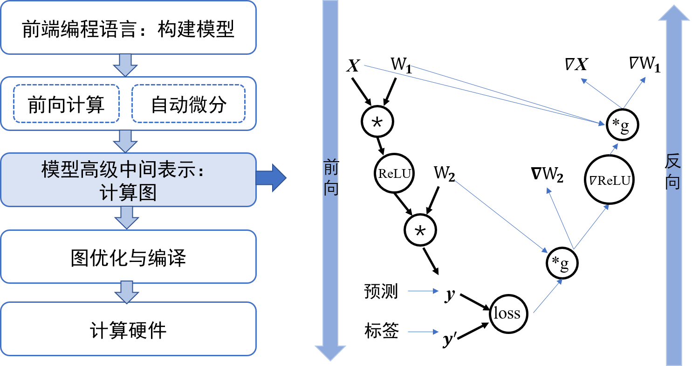
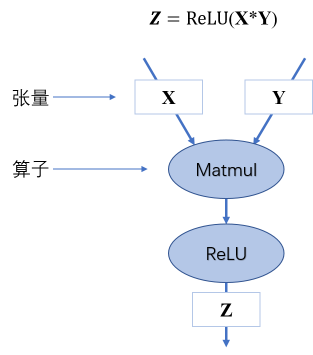
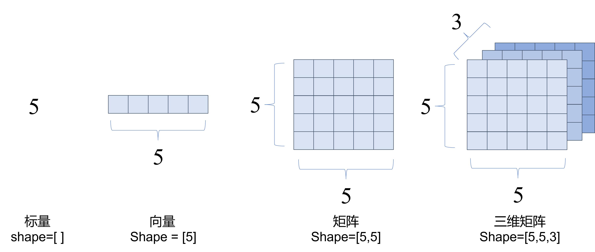
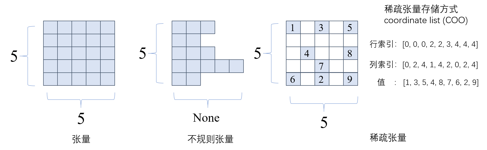
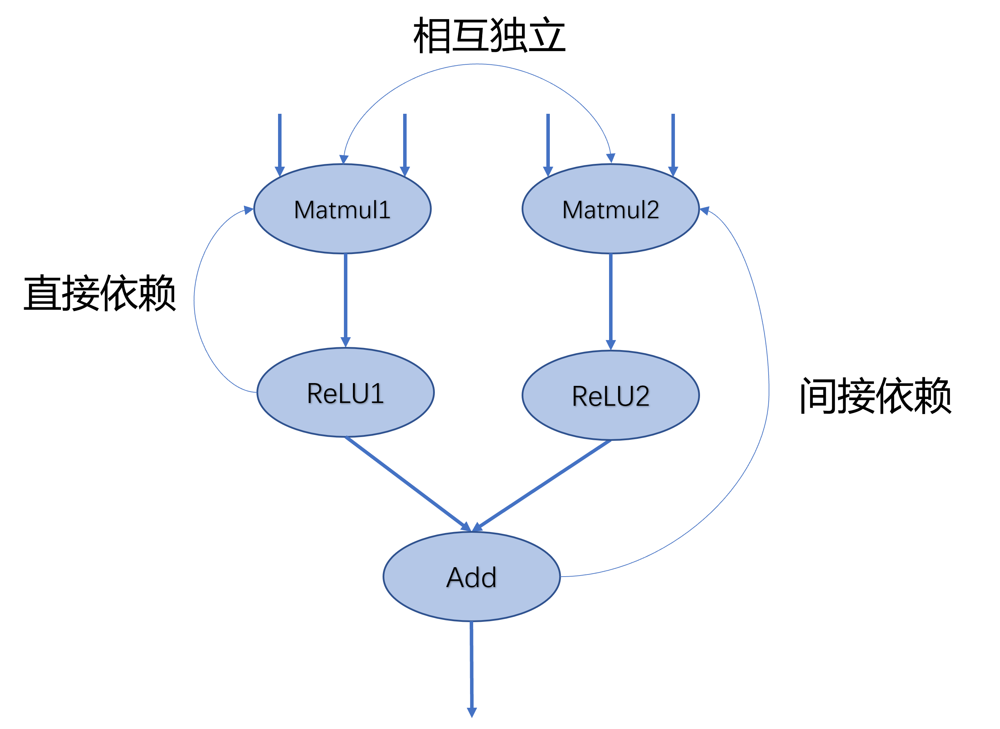
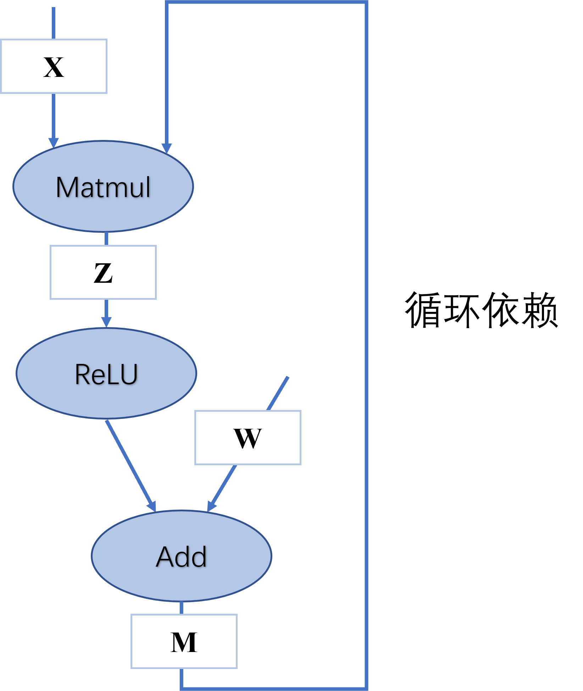
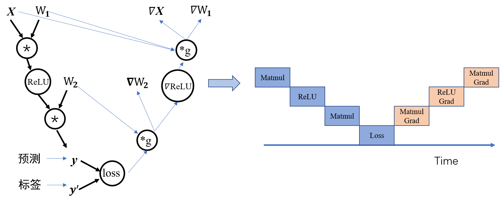
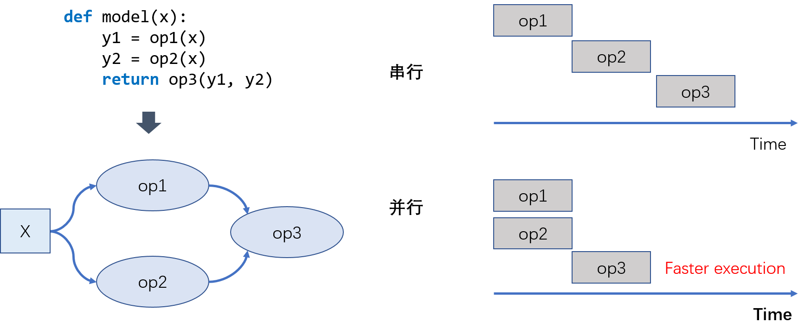

计算图
======

在上一章节中，我们展示了用户的利用机器学习框架所编写的程序。这些用户程序包含了对于训练数据，模型和训练过程的定义。然而为了运行这些程序，机器学习系统依然需要解决诸多问题，包括：如何高效执行一个复杂的机器学习模型？如何识别出机器学习模型中需要训练的参数？如何自动计算更新模型所需的梯度？为了解决这些问题，现代机器学习框架实现了*计算图*(Computational
graph)这一技术。在本章中，我们详细讨论计算图的基本组成，生成和执行等关键设计。本章的学习目标包括：

-   掌握计算图的基本构成。

-   掌握计算图静态生成和动态生成两种方法。

-   掌握计算图的常用执行方法。

计算图的设计背景和作用
----------------------



早期的机器学习框架主要为了支持基于卷积神经网络的图像分类问题。这些神经网络的拓扑结构简单（神经网络层往往通过串行构建），他们的拓扑结构可以用简单的配置文件来表达（例如Caffe中基于Protocol
Buffer格式的模型定义）。随着机器学习的进一步发展，模型的拓扑日益复杂（包括混合专家，生成对抗网络，多注意力模型）。这些模型的复杂拓扑（例如说，分枝结构，带有条件的if-else结构）。而复杂的拓扑会影响模型算子的执行，自动化计算梯度（一般称为自动微分）和训练参数的自动化判断。为此，我们需要一个更加通用的技术来执行任意机器学习模型。因此，计算图应运而生。综合来看，计算图对于一个机器学习框架提供了以下几个关键作用：

-   **对于输入数据，算子和算子执行顺序的统一表达。**
    机器学习框架用户可以用多种高层次编程语言（Python，Julia和C++）来编写训练程序。这些高层次程序需要统一的表达成框架底层C和C++算子的执行。因此，计算图的第一个核心作用是可以作为一个统一的数据结构来表达用户用不同语言编写的训练程序。这个数据结构可以准确表述用户的输入数据，模型所带有的多个算子，以及算子之间的执行顺序。

-   **定义中间状态和模型状态。**
    在一个用户训练程序中，用户会生成中间变量（神经网络层之间传递的激活值和梯度）来完成复杂的训练过程。而这其中，只有模型参数需要最后持久化，从而为后续的模型推理做准备。通过计算图，机器学习框架可以准确分析出中间状态的生命周期（一个中间变量何时生成，以及何时销毁），从而帮助框架更好的管理内存。

-   **自动化计算梯度。**
    用户给定的训练程序仅仅包含了一个机器学习模型如何将用户输入（一般为训练数据）转化为输出（一般为损失函数）的过程。而为了训练这个模型，机器学习框架需要分析任意机器学习模型和其中的算子，找出自动化计算梯度的方法。计算图的出现让自动化分析模型定义和自动化计算梯度成为可能。

-   **高效程序执行。**
    用户给定的模型程序往往是"串行化"地连接起来多个神经网络层。通过利用计算图来分析模型中算子的执行关系，机器学习框架可以更好地发现将算子进行异步执行的机会，从而以更快的速度完成模型程序的执行。

计算图的基本构成
----------------

计算图是用来表示深度学习网络模型在训练与推理过程中计算逻辑与状态的工具。计算框架在后端会将前端语言构建的神经网络模型前向计算与反向梯度计算以计算图的形式来进行表示。计算图由基本数据结构张量(Tensor)和基本运算单元算子(Operator)构成。在计算图中通常使用节点来表示算子，节点间的有向线段来表示张量状态，同时也描述了计算间的依赖关系。如图 [1.2](#fig:ch04/ch04-simpleDAG){reference-type="ref"
reference="fig:ch04/ch04-simpleDAG"}所示，将$\bm{Z}=relu(\bm{X}*\bm{Y})$转化为计算图表示，数据流将根据图中流向与算子进行前向计算和反向梯度计算来更新图中张量状态，以此达到训练模型的目的。

{#fig:ch04/ch04-simpleDAG}

### 张量和算子

在计算框架中，基础组件包含张量和算子，张量是基础数据结构，算子是基本运算单元。在数学中定义中张量是基于向量与矩阵的推广，涵盖标量、向量与矩阵的概念。可以将标量理解为零阶张量，向量为一阶张量，我们熟悉的RGB彩色图像即为三阶张量。在计算框架中张量不仅存储数据，还存储数据类型、数据形状、维度或秩以及梯度传递状态等多个属性，如表[1.1](#tab:ch04/ch4-tensor){reference-type="ref"
reference="tab:ch04/ch4-tensor"}所示，列举了主要的属性和功能。


 |   张量属性       |                           功能                              |
  |------------------ |-------------------------------------------------------------|
 |  形状(shape)     |            存储张量的每个维度的长度，如\[3,3,3\] |
  |  维度或秩(dim)     |       表示张量维度的数量，标量为0，向量为1、矩阵为2|
  | 数据类型(dtype)    |表示存储的数据类型，如bool、int8、int16、float32、float64等|
  | 存储位置(device)    |     创建张量时可以指定存储的设备位置，如CPU、GPU等|
  |    名字(name)        |                     张量的标识符             |


张量的形状是一个重要的属性，它记录了每个轴的长度，也就是张量每个维度的元素数量。秩则代表张量的轴数或者阶数。张量中通常可以保存布尔类型、浮点数、整型数以及复数和字符串数据。每一个张量都具有唯一的数据类型，在计算过程中会对所有参与运算的张量进行类型检查，当发现类型不匹配时就会报错。部分特殊的计算则必须使用指定的数据类型，比如逻辑运算应为布尔类型。在部分计算框架中张量的属性中包含可以指明张量存储的设备位置，比如存储于CPU、GPU等。张量数据的存储状态可以分为可变和不可变两种，不可变张量一般用于用户初始化的数据或者网络模型输入的数据；而可变张量则存储网络权重参数，根据梯度信息更新自身数据。

如图[1.3](#fig:ch04/ch04-tensor){reference-type="ref"
reference="fig:ch04/ch04-tensor"}所示，标量就是一个零阶张量，包含单个数值但没有轴信息。向量即为一阶张量，具有一个轴。二阶张量具有两个轴即秩为二。



通常我们使用的张量是"整齐"的，每个轴上的具有相同的元素个数，就像一个"矩形"或者"立方体"。在特定的环境中，也会使用特殊类型的张量，比如不规则张量和稀疏张量，如图[1.4](#fig:ch04/ch04-tensor1){reference-type="ref"
reference="fig:ch04/ch04-tensor1"}中所示。不规则张量在某个轴上可能具有不同的元素个数，它们支持存储和处理包含非均匀形状的数据，在自然语言处理领域，不规则张量可以存储不同长度文本的信息。稀疏张量则通常应用于图数据与图神经网络中，采用特殊的存储格式如坐标表格式（Coordinate
List， COO），可以高效存储稀疏数据，节省存储空间。



算子是构成神经网络的基本计算单元。算子按照功能可以分为张量操作、神经网络操作、数据流操作和控制流操作等。

-   **张量操作**：包括张量的结构操作和张量的数学运算。张量结构操作有：张量创建、索引切片、维度变换和合并分割等。张量的数学运算包含标量运算、向量运算和矩阵运算。标量运算符的特点是对张量实施逐元素运算。向量运算符只在一个特定轴上运算，将一个向量映射到一个标量或者另外一个向量。矩阵运算包括矩阵乘法、矩阵范数、矩阵行列式、矩阵求特征值、矩阵分解等运算。

-   **神经网络操作**：包括特征提取、激活函数、损失函数、优化算法等。特征提取是机器学习中的常见操作，核心是提取比原输入更具代表性的张量，常见的卷积操作就是特征提取算子。激活函数(Activation
    Function)负责将神经网络层的输入映射到输出端。引入激活函数是为了增加神经网络模型的非线性，没有激活函数的每层都相当于矩阵相乘。常见的激活函数包括S型生长曲线(Sigmoid)、线性矫正单元(Rectified
    Linear Unit, ReLU)等。损失函数(Loss
    Function)是用来估量你模型的预测值与真实值之间的不一致程度。优化算法基于梯度采用不同策略更新参数权值来最小化损失函数，常见的优化算法有随机梯度下降法(Stochastic
    Gradient Descent, SGD)、自适应矩估计(Adaptive Moment Estimation,
    Adam)等。

-   **数据流操作**:包含数据的预处理与数据载入相关算子，数据预处理算子主要是是针对图像数据和文本数据的裁剪填充、归一化、数据增强等操作。数据载入通常会对数据集进行随机乱序(Shuffle)、分批次载入(Batch)以及预载入(Prefetch)等操作。数据流操作主要功能是对原始数据进行处理后，转换为计算框架本身支持的数据格式，并且按照迭代次数输入给网络进行训练或者推理，提升数据载入速度，减少内存占用空间，降低网络训练等待时间。

-   **控制流操作**：可以控制计算图中的数据流向，当表示灵活复杂的模型时需要控制流。使用频率比较高的控制流算子有条件运算符和循环运算符。控制流操作一般分为两类，计算框架本身提供的控制流操作符和前端语言控制流操作符。控制流操作不仅会影响神经网络模型前向运算的数据流向，也会影响反向梯度运算的数据流向。

### 计算依赖

在计算图中，算子之间存在依赖关系，而这种依赖关系影响了算子的执行顺序与并行情况。此外在深度学习算法模型中，计算图是一个有向无环图，也即在计算图中造成循环依赖的数据流向是不被允许的。为了理解计算依赖关系并且分析计算图中循环与循环依赖之间的区别，下面将对计算图中的计算节点依赖关系进行讲解。



如图[1.5](#fig:ch04/ch04-dependence){reference-type="ref"
reference="fig:ch04/ch04-dependence"}中所示，在此简单的计算图中，若将$\mathbf{Matmul1}$算子移除则该节点无输出，导致后续的激活函数无法得到输入，从而计算图中的数据流动中断，这表明计算图中的算子间具有依赖关系并且存在传递性。我们对依赖关系进行区分如下：

-   **直接依赖**：节点$\mathbf{ReLU1}$直接依赖于节点$\mathbf{Matmul1}$，即如果节点$\mathbf{ReLU1}$要执行运算，必须接受直接来自节点$\mathbf{Matmul1}$的输出数据；

-   **间接依赖**：节点$\mathbf{Add}$间接依赖于节点$\mathbf{Matmul1}$，即节点$\mathbf{Matmul1}$的数据并未直接传输给节点$\mathbf{Add}$，而是经过了某个或者某些中间节点进行处理后再传输给节点$\mathbf{Add}$，而这些中间节点可能是节点$\mathbf{Add}$的直接依赖节点，也可能是间接依赖节点；

-   **相互独立**：在计算图中节点节点$\mathbf{Matmul1}$与节点$\mathbf{Matmul2}$之间并无数据输入输出依赖关系，所以这两个节点间相互独立。

掌握依赖关系后，分析图[1.6](#fig:ch04/ch04-recurrent){reference-type="ref"
reference="fig:ch04/ch04-recurrent"}可以得出节点$\mathbf{Add}$间接依赖于节点$\mathbf{Matmul}$，而节点$\mathbf{Matmul}$直接依赖于节点$\mathbf{Add}$，此时两个节点互相等待对方计算完成输出数据，将无法执行计算任务。若我们手动同时给两个节点赋予输入，计算将持续不间断进行，模型训练将无法停止造成死循环。循环依赖产生正反馈数据流，被传递的数值可能在正方向上无限放大，导致数值上溢，或者负方向上放大导致数值下溢，也可能导致数值无限逼近于0，这些情况都会致使模型训练无法得到预期结果。在构建深度学习模型时，应避免算子间产生循环依赖。



在深度学习计算框架中，表示循环关系通常是以**展开**机制（Unrolling）来实现。当需要实现循环关系时，循环体的计算子图按照迭代次数进行复制，将代表相邻迭代轮次的子图进行串联，相邻迭代轮次的计算子图之间就是直接依赖关系。循环三次的计算图进行展开如图[1.7](#fig:ch04/ch04-recurrent-1){reference-type="ref"
reference="fig:ch04/ch04-recurrent-1"}。在计算图中，每一个张量和运算符都具有独特的标识符，即使是相同的操作运算，在参与不同计算任务时都具有不同的标识符。区分循环关系和循环依赖的关键在于，是否两个独特标识符之间的运算互相具有直接依赖和相互依赖。循环关系在展开复制计算子图的时候会给复制的所有张量和运算符赋予新的标识符，区分被复制的原始子图，以避免形成循环依赖。


### 控制流

控制流能够设定特定的顺序执行计算任务。若计算图中无控制流，则每个节点只执行一次，当所有节点按照顺序执行完时，计算图即完成计算。加入控制流后可以让计算图中某些节点循环执行任意次数，也可以根据条件判断选择某些节点不执行，控制流使得我们可以构建更加灵活和复杂的模型。许多机器学习模型依赖控制流进行训练和推理，特别是基于递归神经网络和强化学习的模型就依赖于循环递归关系和依据数据的条件执行。

为了提高性能、可扩展性和表达能力，计算框架必须支持控制流。目前主流的计算框架中通常使用两种方式来提供控制流：

-   **计算框架控制原语**：计算框架在内部设计了低级别细粒度的控制原语运算符，通过原语运算符的结合使用来实现控制流，这种实现方式也被称为图内方法（In-graph
    approach）。此类方法的代表就是TensorFlow([@yu2018dynamic])中的Switch、Merge、Enter、Exit、NextIteration五个原语。TensorFlow通过组合五个原语提供*tf.cond()*和*tf.while_loop()*来实现条件控制和循环控制。

-   **前端语言控制流**：通过高级语言python、C++的控制流语句来进行计算图中的控制决策，这类实现方式也被称为图外方法（Out-of-graph
    approach）。计算框架PyTorch([@paszke2019pytorch])、MindSpore中就直接使用python的控制流，将控制流和数据流之间保持了严格的分离。

图内方法控制流采用框架原语实现，在进行模型编译、优化与运行时都具备优势，并且可以准确的判定机器学习模型中计算梯度时需要缓存的变量，提高运行效率，同时由于不依赖外部语言便于部署到不同环境中去。但由于控制原语缺乏进一步的抽象，对于用户不友好，需要掌握控制原语的使用方法，结合前端语言使用才能描述复杂模型结构。

相对于图内方法，图外方法直接使用前端语言控制流则相对更加灵活易用，用户编写模型控制时更加便捷直观，其缺点在于若要将模型进行优化部署，则需要在编译阶段将前端语言的控制流转化为框架原语描述。

目前在主流的深度学习计算框架中，均提供图外方法和图内方法支持。为了便于理解控制流对前向计算与反向计算的影响，后续的讲解均使用**图外方法**实现控制流。常见的控制流包括条件分支与循环两种。当模型包含控制流操作时，梯度在反向传播经过控制流时，需要在反向梯度计算图中也构造生成相应的控制流，才能够正确计算参与运算的张量梯度。

下面这段代码描述了简单的条件控制，我们使用*matmul*表示矩阵乘法算子：
```python
    def control(A, B, C, conditional = True):
        if conditional:     
            y = matmul(A, B)   
        else:     
            y = matmul(A, C)
        return y
```


图[1.8](#fig:ch04/ch04-if){reference-type="ref"
reference="fig:ch04/ch04-if"}描述上述代码的前向计算图和反向计算图。对于具有if-条件的模型，梯度计算需要知道采用了条件的哪个分支，然后将梯度逻辑应用于该分支。在前向计算图中张量$\bm{C}$经过条件控制不参与计算，在反向计算时同样遵守控制流决策，不会计算关于张量$\bm{C}$的梯度。

当模型中有循环控制时，循环中的操作可以执行零次或者多次。此时采用展开机制，对每一次操作都赋予独特的运算标识符，以此来区分相同运算操作的多次调用。每一次循环都直接依赖于前一次循环的计算结果，所以在循环控制中需要维护一个张量列表，将循环迭代的中间结果缓存起来，这些中间结果将参与前向计算和梯度计算。下面这段代码描述了简单的循环控制，将其展开得到等价代码后，可以清楚的理解需要维护张量$\bm{Y_i}$和$\bm{W_i}$的列表。
```python
    def recurrent_control(X, W, cur_num = 3):
        for i in range(cur_num):    
            Y = matmul(X, W) 
        return Y
    #利用展开机制将上述代码展开，可得到等价表示
    def recurrent_control(X, W, cur_num = 3):
        X1 = matmul(X, W)
        X2 = matmul(X1, W1)
        Y = matmul(X2, W2) 
        return Y
```
如图[1.9](#fig:ch04/ch04-while){reference-type="ref"
reference="fig:ch04/ch04-while"}描述了上述代码的前向计算图和反向计算图，循环控制的梯度同样也是一个循环，它与前向循环相迭代次数相同，执行循环体的梯度计算。循环体输出的梯度值作为下一次梯度计算的初始值，直至循环结束。


### 基于链式法则计算梯度

在上一小节循环展开的例子中，当神经网络接收输入张量$\bm{Y}$后，输入数据根据计算图逐层进行计算并保存中间结果变量，直至经过多层的计算后最终产生输出$\bm{Y_3}$，这个过程我们称之为**前向传播**（Forward
propagation）。在深度神经网络模型训练过程中，前向传播的输出结果与标签值可以产生一个损失函数结果。模型将来自损失函数的数据信息通过计算图反向流动，执行梯度计算来进行更新训练参数，这个过程我们称之为**反向传播**（Back
propagation）。在神经网络模型中，反向传播通常使用损失函数关于参数的梯度来进行更新，也可以使用其他信息进行反向传播，在这里我们仅讨论一般情况。

在这里我们简单回忆一下复合函数的链式法则公式。链式法则是微积分中的求导法则，用于求解复合函数中的导数。复合函数的导数是构成复合有限个函数在相应点的导数乘积。假设*f*和*g*是关于实数*x*的映射函数，设$y=g(x)$并且$z=f(y)=f(g(x))$，则*z*对*x*的导数即为：

$$
\frac{dz}{dx}=\frac{dz}{dy}\frac{dy}{dx}$$

神经网络的反向传播是根据反向计算图的特定运算顺序来执行链式法则的算法。由于神经网络的输入通常为三维张量，输出为一维向量。因此将上述复合函数关于标量的梯度法则进行推广和扩展。假设$\bm{X}$是*m*维张量，$\bm{Y}$为*n*维张量，$\bm{z}$为一维向量，$\bm{Y}=g(\bm{X})$并且$\bm{z}=f(\bm{Y})$，则$\bm{z}$关于$\bm{X}$每一个元素的偏导数即为：

$$
\frac{\partial z}{\partial x_i}=\sum_j\frac{\partial z}{\partial y_j}\frac{\partial y_j}{\partial x_i}$$

上述公式可以等价的表示为：

$$
\nabla_{\bm{X}}\bm{z} = (\frac{\partial \bm{Y}}{\partial \bm{X}})^{\top}\nabla_{\bm{Y}}\bm{z}$$

其中$\nabla_{\bm{X}}\bm{z}$表示$\bm{z}$关于$\bm{X}$的梯度矩阵。

上一小节中简单的循环控制模型前向传播可以表示为$\bm{Y}=\bm{W_2}(\bm{W_1}(\bm{W}(\bm{X})))$。在反向传播的过程中可以将前向计算等价为$\bm{Y}=\bm{W_2}\bm{X_2}$，首先得到参数$\bm{W_2}$的梯度表示。再接着根据$\bm{X_2}=\bm{W_1}\bm{X_1}$得到$\bm{W_1}$的梯度表示，按照层级即可推导得出$\bm{W}$的梯度表示。

$$\begin{aligned}

\nabla\bm{X_2} &= \nabla\bm{Y}\bm{W_2}^\top  \\
\nabla\bm{W_2} &= \bm{X_2}^\top\nabla\bm{Y}   \\
\nabla\bm{X_1} &= \nabla\bm{X_2}\bm{W_1}^\top = (\nabla\bm{Y}\bm{W_2}^\top)\bm{W_1}^\top   \\
\nabla\bm{W_1} &= \bm{X_1}^\top\nabla\bm{X_2} = \bm{X_1}^\top(\nabla\bm{Y}\bm{W_2}^\top)  \\
\nabla\bm{Y} &= \nabla\bm{X_1}\bm{W}^\top = ((\nabla\bm{Y}\bm{W_2}^\top)\bm{W_1}^\top)\bm{W}^\top   \\
\nabla\bm{W} &= \bm{X}^\top\nabla\bm{X_1} = \bm{X}^\top((\nabla\bm{Y}\bm{W_2}^\top)\bm{W_1}^\top)\end{aligned}$$

根据链式法则，相应位置的导数乘积即可将网络得到的损失函数梯度信息传播到每一个权重参数，应用优化器的参数权重更新规则，即可达到神经网络模型参数训练迭代的目的。

根据上述公式我们可以得出循环控制的反向梯度计算过程如下，在下面代码中变量的前缀*grad*代表变量梯度变量，*transpose*代表矩阵转置算子。
```python
    grad_Y2 = matmul(grad_Y3, transpose(W2))
    grad_W2 = matmul(transpose(Y2), grad_Y3)
    grad_Y1 = matmul(grad_Y2, transpose(W1))
    grad_W1 = matmul(transpose(Y1), grad_Y2)
    grad_Y = matmul(grad_Y1, transpose(W))
    grad_W = matmul(transpose(Y), grad_Y1)
```
结合公式、代码以及图[1.10](#fig:ch04/ch04-chain){reference-type="ref"
reference="fig:ch04/ch04-chain"}我们可以看出，在反向传播过程中使用到前向传播的中间变量。因此保存网络中间层输出状态和中间变量，尽管占用了部分内存但能够复用计算结果，达到了提高反向传播计算效率的目的。


在深度学习计算框架中，控制流可以进行嵌套，比如多重循环和循环条件控制，计算图会对复杂控制流进行准确的描述，以便于执行正确的计算调度与执行任务。

计算图的生成
------------

计算框架执行深度学习模型训练时，会根据模型结构生成计算图，通过调度计算图完成模型计算。在计算框架中可以生成静态图和动态图两种计算图。静态图对应声明式编程范式，动态图对应命令式编程范式。静态生成可以根据前端语言描述的神经网络拓扑结构以及参数变量等信息构建一份固定的计算图，因此静态图在执行期间可以不依赖前端语言描述常用于神经网络模型的部署，比如移动端人脸识别场景中的应用等。动态图则需要在每一次执行神经网络模型依据前端语言描述动态生成一份临时的计算图，这意味着计算图的动态生成过程灵活可变，该特性有助于我们在神经网络结构调整阶段提高效率。主流计算框架TensorFlow、MindSpore、PyTorch均支持动态图和静态图模式。了解两种计算图生成方式的优缺点及构建执行特点，可以针对待解决的任务需求，选择合适的生成方式调用执行神经网络模型。

### 静态生成

静态图的生成与执行原理如图[1.11](#fig:ch04/ch04-static){reference-type="ref"
reference="fig:ch04/ch04-static"}所示，采用先编译后执行的方式，该模式将计算图的定义和执行进行分离。在静态图模式下使用前端语言定义模型形成完整的程序表达后，并不使用前端语言解释器进行执行，而是将前端描述的完整模型交给计算框架。框架在执行模型计算之前会首先对神经网络模型进行分析，获取网络层之间的连接拓扑关系以及参数变量设置、损失函数等信息，接着用一种特殊的静态数据结构来描述拓扑结构及其他神经网络模型组件，这种特殊的静态数据结构通常被称为静态计算图。静态计算图可以通过优化策略转换成等价的更加高效的结构。当进行模型训练或者推理过程时，静态计算图接收数据并通过相应硬件调度执行图中的算子来完成任务。


以构建并执行下列伪代码，来详细讲解静态图的生成与执行，*matmul*表示矩阵乘法算子，*relu*表示线性矫正单元算子。在部分计算框架中如TensorFlow进行前端定义时，需要声明并编写包含数据占位符、损失函数、优化函数、网络编译、执行环境以及网络执行器等在内的预定义配置项，此外还需要使用图内控制流算子编写控制语句，代码较为繁琐并缺乏可读性。随着计算框架设计的改进与发展，框架提供的编程接口和模型构建模式呈现出更加统一和友好的趋势，比如MindSpore提供动静态统一的前端编程表达。因此为了便于理解静态生成的过程与原理，此处使用更加简洁的语言逻辑描述模型。
```python
    def model(X, flag):
        if flag>0:     
            Y = matmul(W1, X)   
        else:     
            Y = matmul(W2, X)
        Y = Y + b
        Y = relu(Y)
        return Y
```
完成前端语言的模型完整构建表达后，执行模型运算时不会直接接收输入数据进行计算，而是使用计算框架的编译器对模型进行编译。由于在进行静态生成编译时并不读取输入数据，此时需要一种特殊的张量来表示输入数据辅助构建完整的计算图，这种特殊张量就被称之为"数据占位符"。在上述的伪代码中输入数据**X**需要使用占位符在静态图中表示。构造伪代码中的条件控制时，由于在静态图模式下构建网络并没有执行任何计算，对于条件控制在编译阶段并不会进行逻辑运算完成判断，因此需要将条件控制算子以及所有的分支计算子图加入计算图中。在执行阶段网络接受数据流入，调度条件控制算子时进行逻辑判断，控制数据流入不同的分支计算子图中进行后续计算。由于控制流和静态生成的特殊性，在部分计算框架中前端语言python的控制流不能够被正确编译为等价的静态图结构，因此需要使用复杂的图内方法实现控制流。

在后续的章节中我们会继续深入了解计算框架静态生成图结构的过程。静态生成的过程是采用计算框架编译器将代码编译为中间表示。计算框架编译器受传统编译器方案启发，设计体系结构包含两部分编译器前端和编译器后端。中间表示承上启下贯穿前端和后端，是前端源代码和目标硬件代码之间的中间数据格式。在计算框架编译器中中间表示以计算图形式存在，编译器会根据前端神经网络模型自动构建完整的前向计算图和反向计算图。


经过编译后获取完整的计算图，能够根据全局信息完成图优化策略，进行编译优化形成与模型完全等价的静态图。编译器前端负责完成计算图与硬件无关的转换和优化，比如算子融合将网络中的两个或多个细粒度的算子融合为一个粗粒度算子,比如图[1.12](#fig:ch04/ch04-static-gen){reference-type="ref"
reference="fig:ch04/ch04-static-gen"}中将*add*算子与*relu*合并为一个操作，可节省中间计算结果的存储、读取等过程，降低框架底层算子调度的开销，从而提升执行性能和效率。编译器后端负责与硬件相关的计算图优化、代码指令生成和编译，优化手段包括硬件算子选择、内存分配、内存复用等，提高算子执行效率和内存利用效率，降低内存开销。编译器后端因此使用静态图模型运行往往能够获取更好的性能和更少的内存占用。在后续章节中将详细介绍更多编译器前端和编译器后端的优化策略。

优化完成的计算图通过编译器后端根据计算硬件来生成适配的执行代码。在执行阶段，调用执行器接受输入数据，依据计算图调度算子执行训练或者推理任务。在训练任务调度算子执行时，由于在执行阶段已经编译获取模型整体结构，计算框架可以利用自动并行算法制定合理的模型切分与并行策略，进一步提高计算效率。

使用静态图构建模型，编译构建完整的计算图后，计算图可以进行序列化保存，并且再次执行时允许使用序列化模型直接进行训练或推理，不需要再次编译前端语言源代码。得益于编译器前端、中间表示、编译器后端多级的计算框架编译器体系结构，编译器后端可以将神经网络模型中间表示转换为不同硬件代码。结合计算图序列化和计算图可转换多种部署硬件代码两种特性，使得静态图模型可以直接部署在不同的硬件上面，提供高效的推理服务。

尽管静态图具备强大的执行计算性能与直接部署能力，但是在部分计算框架中静态图模式下，使用前端语言编写神经网络模型以及定义模型训练过程代码较为繁琐，尤其掌握图内控制流方法具备一定的学习难度，因此熟练掌握并使用静态图模式对于初学者并不友好。其次，静态生成采用先编译后执行的方式，编译阶段和执行阶段分离，前端语言构建的神经网络模型经过编译后，计算图结构便固定执行阶段不再改变，并且经过优化用于执行的计算图结构与原始代码有较大的差距，导致代码中的错误难以定位到准确位置，增加了代码调试难度。此外在神经网络模型开发迭代环节，不能即时打印中间结果。若要需要在前端源码中增加输出环节，则需要将源码重新编译后，再调用执行器才能获得输出，降低了代码调试效率。而动态图模式则拥有更加灵活的特性，接下来讲解动态生成机制。

### 动态生成

动态图原理如图[1.13](#fig:ch04/ch04-eager1){reference-type="ref"
reference="fig:ch04/ch04-eager1"}所示，采用解析式的执行方式，其核心特点是编译与执行同时发生。动态图采用前端语言自身的解释器对代码进行解析，利用计算框架本身的算子分发功能，算子会即刻执行并输出结果。动态图模式采用用户友好的命令式编程范式，使用前端语言构建神经网络模型更加简洁。


由于动态图模式的编程友好性，动态图被广大深度学习研究者青睐使用。接下来使用上一小节的伪代码来讲解动态生成和静态生成的区别。

尽管静态图和动态图在前端语言表达上略有差异，但本质的区别在于静态生成和动态生成的编译执行过程不同。使用前端语言构建完成模型表达后，动态生成并不采用计算框架编译器生成完整的静态计算图，而是采用前端语言的解释器Python
API调用计算框架，框架利用自身的算子分发功能，将Python调用的算子在相应的硬件如CPU、GPU、NPU等上进行加速计算，然后再将计算结果返回给前端。该过程并不产生静态的计算图，而是按照前端语言描述模型结构，按照计算依赖关系进行调度执行，动态生成临时的图拓扑结构。


如图[1.14](#fig:ch04/ch04-dynamic-gen){reference-type="ref"
reference="fig:ch04/ch04-dynamic-gen"}中所示，神经网络前向计算按照模型声明定义的顺序进行执行。当模型接收输入数据$\bm{X}$后，计算框架开始动态生成图拓扑结构，添加输入节点并准备将数据传输给后续节点。模型中存在条件控制时，动态图模式下会即刻得到逻辑判断结果并确定数据流向，因此在图中假设判断结果为真的情况下，图结构中仅会添加关于张量$\bm{W1}$的*matmul*算子节点。按照代码制定的模型计算顺序与算子依赖关系，计算框架会依次添加*add*算子节点和*ReLU*算子节点。计算框架会在添加节点的同时完成算子分发计算并返回计算结果，同时做好准备向后续添加的节点传输数据。当模型再次进行前向计算时，动态生成的图结构则失效，并再次根据输入和控制条件生成新的图结构。相比于静态生成，可以发现动态生成的图结构并不能完整表示前端语言描述的模型结构，需要即时根据控制条件和数据流向产生图结构。由于计算框架无法通过动态生成获取完整的图结构，因此动态图模式下难以进行图结构优化以提高计算效率。

在静态生成环节，由于已经获取完整的神经网络模型定义，因此可以同时构建出完整的前向计算图和反向计算图。而在动态生成中，由于边解析边执行的特性，反向梯度计算的构建随着前向计算调用而进行。在执行前向过程中，计算框架根据前向算子的调用信息，记录对应的反向算子信息以及参与梯度计算的张量信息。前向计算完毕之后，反向算子与张量信息随之完成记录，计算框架会根据前向动态图拓扑结构，将所有反向过程串联起来形成整体反向计算图。最终，将反向图在计算硬件上执行计算得到梯度用于参数更新。

对应于图[1.14](#fig:ch04/ch04-dynamic-gen){reference-type="ref"
reference="fig:ch04/ch04-dynamic-gen"}中，当调用到关于张量$\bm{W1}$的*matmul*算子节点时，框架会执行两个操作：调用*matmul*算子，计算关于输入$\bm{X}$和$\bm{W1}$的乘积结果，同时根据反向计算过程$\bm{Grad\_W1}=\bm{Grad\_Y}*\bm{X}$,记录下需要参与反向计算的算子和张量$\bm{X}$。计算框架依照算子调度顺序记录参与反向计算的算子和张量。当前向计算执行完毕，计算框架根据动态生成的前向计算图结构拓扑关系，利用记录的反向计算算子和张量动态生成反向计算图，最终完成神经网络模型的梯度计算和参数更新。

尽管动态生成中完整的网络结构在执行前是未知的，不能使用静态图中的图优化技术来提高计算执行性能。但其即刻算子调用与计算的能力，使得模型代码在运行的时候，每执行一句立即进行运算并会返回具体的值，方便开发者在模型构建优化过程中的进行错误分析、结果查看等调试工作，为研究和实验提供了高效的助力。

此外得益于动态图模式灵活的执行计算特性，动态生成可以使用前端语言的原生控制流，充分发挥前端语言的编程友好性特性。解决了静态图中代码难调试、代码编写繁琐以及控制流复杂等问题，对于初学者更加友好，提高了算法开发迭代效率和神经网络模型改进速率。

### 动态和静态生成的比较

静态生成和动态生成的过程各有利弊。从使用者的角度可以直观的感受到静态图不能实时获取中间结果、代码调试困难以及控制流编写复杂，而动态图可以实时获取结果、调试简单、控制流符合编程习惯。虽然静态图的编写、生成过程复杂，但是相应的执行性能却超过动态图，我们用一个简单的例子来说明在性能和内存占用方面静态图的优势。
```python
    def model(X1, X2):
        Y1 = matmul(X1, W1)
        Y2 = matmul(X2, W2)
        Y = Y1 + Y2
        output = relu(Y)
        return output
```
在静态生成过程中，计算框架获取完整的计算图可以分析出计算$\bm{Y_1}$和$\bm{Y_2}$的过程相对独立，可以将其进行自动并行计算，加快计算效率。而动态生成的过程中，若无手动配置并行策略，计算框架无法获取图结构不能分析出算子之间的独立性，则只能按照代码顺序执行。模型在输出结果之前执行了*add*和*relu*算子操作，在静态生成过程中利用计算图优化策略中的算子融合方法，可以将这两个算子融合为一个算子执行，这样减少了中间变量$\bm{Y}$的存储与读取过程，加快了计算效率，减少了内存占用。而动态生成过程则需要按照顺序执行*add*和*relu*两步操作，需要存储变量$\bm{Y}$。除此之外，由于静态生成能够同时分析重构出前向计算图和反向计算图，可以提前确定反向计算中需要保存的前向中间变量信息。而动态生成则在完成前向计算后才能构建出反向计算图，为了保证反向计算效率需要保存更多的前向计算中间变量信息，相比之下静态生成的过程更加节省内存占用。

为了方便读者对比，将静态图和动态图特性总结见表 [1.2](#tab:ch04/ch4-graph){reference-type="ref"
reference="tab:ch04/ch4-graph"}。


 |          特性         |    静态图   |     动态图    |
 |----------------------| ------------ |--------------|
 |    即时获取中间结果    |     否       |     是      |
 |      代码调试难易      |     难      |     简单      |
 |     控制流实现方式     | 特定的语法  | 前端语言语法    |
 |          性能          |       优化策略多，性能更佳   |      图优化受限，性能较差  |            
 |        内存占用        |     内存占用少       | 内存占用相对较多  |
 |        部署能力         |可直接部署  | 不可直接部署|


针对两种模式的特性，结合任务需求选择合适的模式可以事半功倍，学术科研以及模型开发调试阶段，为了快速验证思想和迭代更新模型结构可以选择动态图模式进行构建算法；网络模型确定，为了加速训练过程或者为硬件部署模型，可以选择静态图模式。

### 动态图与静态图的转换和融合

动态图模式下拥有简洁的接口和编程体验，具备友好的调试交互机制。代码按照编写顺序即时执行，符合我们在编写模型的直观感受和习惯。可以快速将算法思想转化为实际代码。静态图模式下可以分离前后端语言，编译解析前端语言构建的整体网络结构，并进行优化后以高效后端语言执行，可以直接用于部署。为了兼顾了动态图易用性和静态图部署性能两方面优势，目前TensorFlow、MindSpore、PyTorch、PaddlePaddle等主流计算框架均具备动态图转静态图的功能，支持使用动态图编写代码，框架自动转换为静态图网络结构。

动态图转换为静态图的实现方式有两种：

-   **基于追踪转换**：以动态图模式执行并记录调度的算子，构建和保存为静态图模型。

-   **基于源码转换**：分析前端代码来将动态图代码自动转写为静态图代码，并在底层自动帮用户使用静态图执行器运行。

**基于追踪转换**的原理相对简单，当使用动态图模式构建好网络后，使用追踪（Tracing）进行转换将分为两个阶段。第一个阶段计算框架会创建一个新的计算图，此时以动态图模式执行代码，计算框架会自动追踪数据流的流动以及算子的调度，将所有的操作捕获并根据调度顺序构建静态图模型。第二个阶段，当执行完一次动态图后，计算框架已生成静态图，当再次调用相同的模型时，计算框架会自动指向静态图模型，以高效的性能执行计算。追踪技术只是记录第一次执行动态图时调度的算子，但若是模型中存在依赖于中间结果的条件分支控制流，只能追踪到根据第一次执行时触发的分支。此时构建的静态图模型并不是完整的，缺失了数据未流向的其他分支。在后续的调用中，因为静态模型已无法再改变，若计算过程中数据流向缺失分支会导致模型运行错误。同样的，依赖于中间数据结果的循环控制也无法追踪到全部的迭代状态。

动态图基于前端语言自身的解释器进行模型代码的解析执行。比如当python作为前端语言，采取原生python边运行边解释的特性，配合框架提供的数据处理/算子分发的功能计算，即可实现动态图的即时执行特性。而且静态图则采用计算框架自带的图编译器，对神经网络模型进行建图后，再调用图结构进行计算。动态图代码与静态图代码之间存在差异，不能直接使用静态图编译器，因此基于源码转换的方法需要将动态图代码转换为静态图代码描述。

**基于源码转换**的方式则能够改善基于追踪转换的缺陷。如图[1.15](#fig:ch04/ch04-ast){reference-type="ref"
reference="fig:ch04/ch04-ast"}中所示，基于源码转换的流程经历两个阶段。第一个阶段，对动态图模式下的代码扫描进行词法分析，通过词法分析器分析源代码中的所有字符，对代码进行分割并移除空白符、注释等，将所有的单词或字符都转化成符合规范的语法单元列表。接着进行语法分析即解析器，将得到的语法单元列表转换成树形式，并对语法进行检查避免错误。第二阶段，动态图转静态图的核心部分就是对抽象语法树进行转写，计算框架中对每一个需要转换的语法都预设有转换器，每一个转换器对语法树进行扫描改写，将动态图代码语法映射为静态图代码语法。其中最为重要的前端语言控制流，会在这一阶段分析转换为静态图接口进行实现。转写完毕之后，将新的语法树再还原回静态图代码，就可以使用静态生成执行。使用该方式可以避免基于追踪转换中控制流表达缺失的情况。


在使用上述功能的过程中，可以将整体模型动态图代码全部转换为静态图代码，提高计算效率并用于硬件部署。同时也可以将整体模型中的部分函数转化为局部静态子图，静态子图会被计算框架视为一个完整的算子并嵌入动态图中。执行整体动态图时，当计算到对应的函数会自动调用静态子图。使用该方式在一定程度上既保留代码调试改进的灵活性，又提高了计算效率。
```python
    @ms_function #mindspore中基于源码转换的函数装饰器，可以将该函数转换为静态图
    def add_and_relu(Y, b):
        Y = Y + b
        Y = relu(Y)
        return Y

    def model(X, flag):
        if flag>0:     
            Y = matmul(W1, X)   
        else:     
            Y = matmul(W2, X)
        Y = add_and_relu(Y, b)
        return Y
```
代码中模型整体可以采用动态生成，而\@ms\_function可以使用基于源码转换的技术将模块*add_and_relu*的转化为静态图结构。与动态生成中代码执行相同，模型接受输入按照模型定义的计算顺序进行调度执行，并生成临时图结构，当执行语句*Y=add_and_relu(Y,
b)* 时，计算框架会自动调用该模块静态生成的图结构执行计算。模块*add_and_relu* 可以利用静态图中的优化技术来提高计算性能，实现动态图和静态图的混合执行。此外，动静态转换的技术常用于模型部署阶段，动态图预测部署时除了需要已经训练完成的参数文件，还须提供最初的模型组网前端代码，这使得动态图部署受到局限性，部署硬件中往往难以提供支持前端语言执行环境。因此当使用动态图模式训练完成模型参数后，可以将整体网络结构转换为静态图格式，将神经网络模型和参数文件进行序列化保存，与前端代码完全解耦，扩大模型部署的硬件支持范围。

主流的计算框架TensorFlow、MindSpore等中均提供动静态相互转换与融合执行的技术，我们将各框架中支持源码转换和追踪转换技术的接口梳理如下表[1.3](#tab:ch04/ch4-eagertoscript){reference-type="ref"
reference="tab:ch04/ch4-eagertoscript"}所示。

|                            框架                              | 动态图转静态图   |
 |  ------------------------------------------------------------  |---------------- |
 |                           TensorFlow                          |@tf_function追踪算子调度构建静态图，<br>其中AutoGraph机制可以自动转换控制流为静态表达 |
 |          MindSpore     |   context.set_context(mode=context.PYNATIVE_MODE) 动态图模式  <br> context.set_context(mode=context.GRAPH_MODE) 静态图模式   <br>\@ms_function支持基于源码转换    |
|           PyTorch           |        torch.jit.script()支持基于源码转换，<br>torch.jit.trace()支持基于追踪转换                  |
| PaddlePaddle | paddle.jit.to_static()支持基于源码转换，<br>paddle.jit.TracedLayer.trace()支持基于追踪转换 |
               
                                                           


计算图的调度
------------

模型训练就是计算图调度图中算子的执行过程。宏观来看训练任务是由设定好的训练迭代次数来循环执行计算图，此时我们需要优化迭代训练计算图过程中数据流载入和模型训练（推理）等多个任务之间的调度执行。微观上单次迭代需要考虑计算图内部的调度执行问题，根据计算图、计算依赖关系、计算控制分析算子的任务调度队列。优化计算图的调度和执行性能，目的是为了尽可能充分利用计算资源，提高计算效率，缩短模型训练和推理时间。接下来会详细介绍计算图的调度和执行。

### 算子调度执行

算子的执行调度包含两个步骤，第一个，根据拓扑排序算法，将计算图进行拓扑排序得到线性的算子调度序列；第二步，将序列中的算子分配到执行流进行运算。算子调度执行的目标是根据计算图中算子依赖关系，确定算子调度序列，尽可能将序列中的算子并行执行，提高计算资源的利用率。

计算图中依赖边和算子构成了一张有向无环图(Directed Acyclic
Graph)，计算框架后端需要将包含这种依赖关系的算子准确地发送到计算资源，比如GPU、NPU上执行。因此，就要求算子需要按照一定的顺序排列好再发送给GPU/NPU执行。针对有向无环图，我们通常使用拓扑排序来得到一串线性的序列。

如图 [1.16](#fig:ch04/ch04-diaoduzhixing){reference-type="ref"
reference="fig:ch04/ch04-diaoduzhixing"}所示，左边是一张有向无环图。图中包含了a,b,c,d,e五个节点和a-\>d,b-\>c,c-\>d,d-\>e四条边(a-\>d表示d依赖于a，称之为依赖边)。将图的依赖边表达成节点的入度(图论中通常指有向图中某点作为图中边的终点的次数之和)，可以得到各个节点的入度信息(a:0,
b:0, c:1, d:2,
e:1)。拓扑排序就是不断循环将入度为0的节点取出放入队列中，直至所有有向无环图中的节点都加入到队列中，循环结束。例如，第一步将入度为0的a,b节点放入到队列中，此时有向无环图中c,d的入度需要减1，得到新的入度信息(c:0,
d:1, e:1)。以此类推，将所有的将所有的节点都放入到队列中并结束排序。

{#fig:ch04/ch04-diaoduzhixing}

生成调度序列之后，需要将序列中的算子与数据分发到指定的GPU/NPU上执行运算。根据算子依赖关系和计算设备数量，可以将无相互依赖关系的算子分发到不同的计算设备，同时执行运算，这一过程称之为并行计算，与之相对应的按照序贯顺序在同一设备执行运算被称之为串行计算。在深度学习中，当数据集和参数量的规模越来越大，我们在分发数据与算子时通信消耗会随之而增加，计算设备会在数据传输的过程中处于闲置状态，此时采用同步与异步的任务调度机制可以更好的协调通信与训练任务，提高通信模块与计算设备的使用率，在后续的小节中将详细介绍串行与并行、同步与异步的概念。

### 串行与并行

根据任务队列的执行顺序，我们可以将计算图的任务调度队列分为一下两种：

-   **串行**：队列中的任务必须按照顺序进行调度执行直至队列结束；

-   **并行**：队列中的任务可以同时进行调度执行，加快执行效率。

首先我们从微观上来分析计算图内部的串行调度。计算图中大多数算子之间存在直接依赖或者间接依赖关系，具有依赖关系的算子间任务调度则必定存在执行前后的时间顺序。如图[1.17](#fig:ch04/ch04-diaodu){reference-type="ref"
reference="fig:ch04/ch04-diaodu"}，计算图接受输入数据进行前向计算得到预测值，计算损失函数进行反向梯度计算，整体代码流程后序算子的计算有赖于前序算子的输出。此时算子的执行队列只能以串行的方式进行调度，保证算子都能正确接受到输入数据，才能完成计算图的一次完整执行。



宏观上来看迭代训练之间，每一轮迭代中计算图必须读取训练数据，执行完整的前向计算和反向梯度计算，将图中所有参数值更新完毕后，才能开始下一轮的计算图迭代计算更新。所以"数据载入-数据处理-模型训练"的计算图整体任务调度是以串行方式进行的。

在分析计算图内部算子依赖关系时，除了直接依赖和间接依赖之外，存在算子间相互独立的情况。如图[1.18](#fig:ch04/ch04-para){reference-type="ref"
reference="fig:ch04/ch04-para"}中op1和op2之间相互独立，此时可以将两个算子分配到两个硬件上进行并行计算。对比串行执行，并行计算可以同时利用更多的计算资源来缩短执行时间。



并行包括算子并行、模型并行以及数据并行。算子并行不仅可以在相互独立的算子间执行，同时也可以将单个算子合理的切分为相互独立的两个子操作，进一步提高并行性。模型并行就是将整体计算图进行合理的切分，分配到不同设备上进行并行计算，缩短单次计算图迭代训练时间。数据并行则同时以不同的数据训练多个相同结构的计算图，缩短训练迭代次数，加快训练效率。这三种并行方式将在后续章节中进行详细讲解。

### 数据载入同步与异步机制

一次完整计算图的训练执行过程包含：数据载入、数据预处理、网络训练三个环节。三个环节之间的任务调度是以串行方式进行，每一个环节都有赖于前一个环节的输出。但计算图的训练是多轮迭代的过程，多轮训练之间的三个环节可以用同步与异步两种机制来进行调度执行。

-   **同步**：顺序执行任务，当前任务执行完后会等待后续任务执行情况，任务之间需要等待、协调运行；

-   **异步**：当前任务完成后，不需要等待后续任务的执行情况，可继续执行当前任务下一轮迭代。

以同步机制来执行计算图训练时，如图[1.19](#fig:ch04/ch04-tongbu){reference-type="ref"
reference="fig:ch04/ch04-tongbu"}所示，每一轮迭代中，数据读取后进行数据预处理操作，然后传输给计算图进行训练。每一个环节执行完当前迭代中的任务后，会一直等待后续环节的处理，直至计算图完成一次迭代训练更新参数值后，才会进行下一轮迭代的数据读取、数据处理以及网络训练。当进行数据载入时，数据处理、模型训练处于等待的状态，相反模型处于训练时，数据载入的I/O通道处于空闲，同步机制造成计算资源和通信资源的浪费。


以异步机制来执行计算图训练时，如图[1.20](#fig:ch04/ch04-yibu){reference-type="ref"
reference="fig:ch04/ch04-yibu"}所示，在迭代训练中，当数据通道将数据读取后交给后续的数据与处理环节后，不需要等待计算图训练迭代完成，直接读取下一批次的数据。对比同步机制，异步机制的引入减少了数据载入、数据预处理、网络训练三个环节的空闲等待时间，能够大幅度缩短循环训练的整体时间，提高任务执行效率。


当我们将异步机制与并行计算结合在一起，如图[1.21](#fig:ch04/ch04-yibubingxing){reference-type="ref"
reference="fig:ch04/ch04-yibubingxing"}所示，利用丰富的计算资源可以进一步提高计算图训练效率，缩短训练时间。


总结
----

-   为了兼顾编程的灵活性和计算的高效性，设计了基于计算图的深度学习框架。

-   计算图的基本数据结构是张量，基本运算单元是算子。

-   计算图可以表示机器学习模型的计算逻辑和状态，利用计算图分析图结构并进行优化。

-   计算图是一个有向无环图，图中算子间可以存在直接依赖和间接依赖关系，或者相互关系独立，但不可以出现循环依赖关系。

-   可以利用控制流来改变数据在计算图中的流向，常用的控制流包括条件控制和循环控制。

-   利用计算图和算子间依赖关系可以进行模型中的算子执行调度问题。

-   根据计算图可以找到相互独立的算子进行并发调度，提高计算的并行性。而存在依赖关系的算子则必须依次调度执行。

-   计算图的训练任务可以使用同步或者异步机制，异步能够有效提高硬件使用率，缩短训练时间。

-   计算图可以分为静态图和动态图两种构建和执行方式。静态图使用声明式编程，动态图使用命令式编程。

-   静态图计算效率高，内存使用效率高，但调试性能较差，可以直接用于模型部署。

-   动态图提供灵活的可编程性和可调试性，可事实得到计算结果，在模型调优与算法改进迭代方面具有优势。